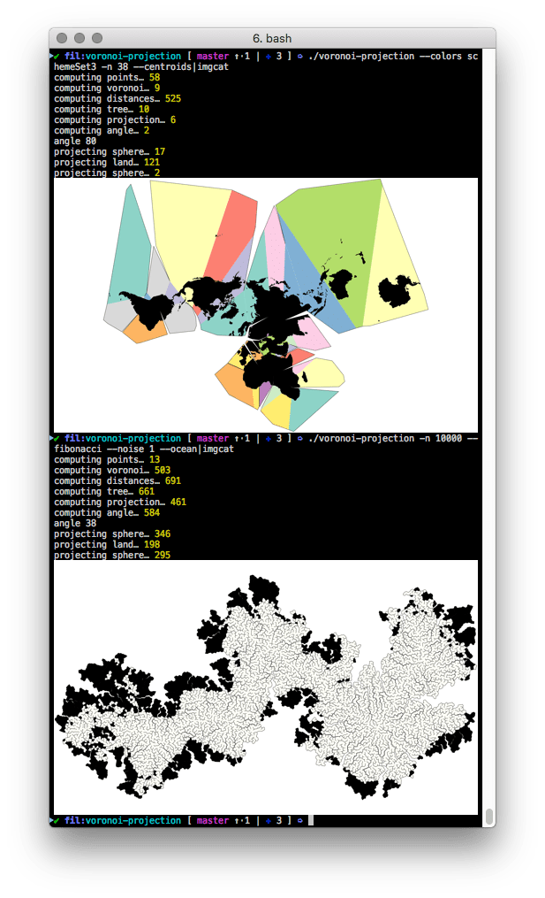

# The Voronoi projection

```
Usage: voronoi-projection [options]

Generate a Voronoi map.

Options:

  -V, --version         output the version number
  -n, --n <value>       number of faces (default: 200)
  -w, --width <value>   width (default: 1920)
  --height <value>      height (default: null)
  --colors <value>      color scheme (default: none)
  --background <value>  background color ('' for transparent) (default: white)
  --angle <value>       angle (in degrees) (default: auto)
  --graticule           show graticule
  --land <value>        strategy for land (auto, full, point, poly, none) (default: auto)
  --ocean               favor ocean links
  --fibonacci           fibonacci distribution
  --centroids           large countries centroids distribution
  --noise <value>       perturbation (try: 1) (default: 0)
  -h, --help            output usage information
```

Comments and timings will be printed to STDERR, and the resulting image sent to STDOUT.

Typical usage could be:
```
./voronoi-projection > voronoi-world.png
```

or:
```
./voronoi-projection --colors schemeSet3 --centroids | imgcat
```



